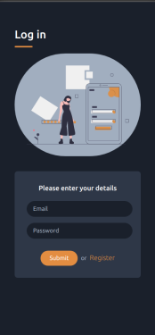
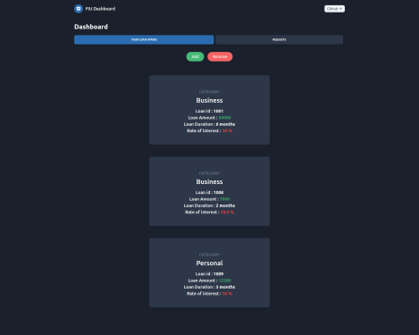
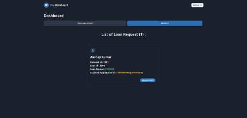
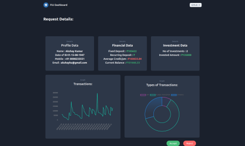
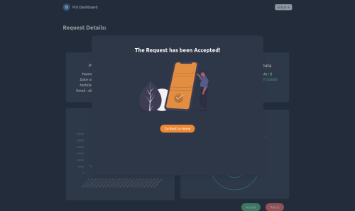

  
  <h1 align= "center">Samriddhi</h1>

Have a transaction stuck up due to undelivered documentation? Unable to cope with the confusing and tedious procedure of taking out a loan? Then this is the app for you! Sign up and we promise your application will not bounce!

## Deliverables

* ### [Presentation:]() Will be updated soon.
* ### [User App:](https://vercel.com/scarletspidey/rev-segmentation-fault/aqarfspow) Please follow the link (Work In Progress)
* ### [FIU website:](https://vercel.com/scarletspidey/fiu-dashboard/2vwqa5o4l) Please follow the link (Work In Progress)

## Overview  

Our country is filled with people who aren’t very stable financially. Unlike those of us who are better along with respect to our finances, they don’t have the liberty to get into the currently tedious process of taking out a loan. Ironically, in the “golden age” of technology, we have yet to find a holistic solution to this issue. Not everyone can obtain statements of their transaction history for the purpose of applying loans to NBFCs, even for meager amounts. One of the solutions is to give the companies access to their banking details to make the process more fluid. But that comes with your own privacy concerns. Giving out one’s banking details is equivalent to getting down on your knees waiting for a bear to pass without harming you. How do we solve this? This is the issue we’ve chosen  to focus on, because what better problem to find an innovative solution to an everyday problem that hundreds of thousands of people face.

## Goals
<h6> 1. API integrated account aggregator: </h6>
Using a framework called Account Aggregator, the development of which involved the developers of UPI, we  have worked out a way to bridge the gap between banks who archive your info, and the Financial Information Users (Tertiary Banks and/or companies which require your information) that the user wants to share his/her details with, without putting himself in financial jeopardy. 

<h6> 2. Dynamically Granular access control: </h6>
One very simple way to bypass most attempts at data manipulation and credential phishing is to limit the duration of access which is available to the FIU. Our solution gives the user absolute control over his/her data and makes it super easy for them to control how much information is to be shared (explicit queries) and for how long it is to be shared (Access tenure control).

## Illustrations

## A look at the User App

The image that follows is a look at the Get started page of the user app.

The image below shows the login page of the user app.

What follows is the home screen of the app post login.

Below is the "Request a loan Tab".

## A look at the FIU Dashboard

The following are the three tabs of the FIU dashboard website.
 
 
 
 
 
 
 
 The image below is what the admin can see, when they accept a request.
 
 
 

# Team

 * ### Karan Nandwani 
        
 * ### Tamizhiniyan S R
        
 * ### Shobit Puri 
        
* ### Aman Ojha
        
